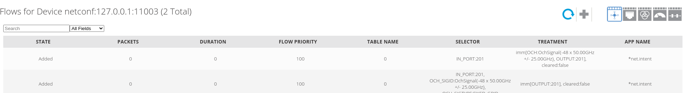

## odtn Phase 1.5 Demo


1. start onos, ternimal devices and OLS devices
   ```bash
   # via docker-compose
   make start
   ```
2. config devices and links
   ```bash
   # please wait for onos to fully start
   make netcfg-device
   make netcfg-link
   ```
3. create connect
   ```bash
   python2.7 execute-tapi-post-call.py 127.0.0.1 tapi-connectivity:create-connectivity-service line-side
   ```
   
   
   
   
   

4. delete connect
   ```bash
   python2.7 execute-tapi-delete-call.py 127.0.0.1 both
   ```
   


